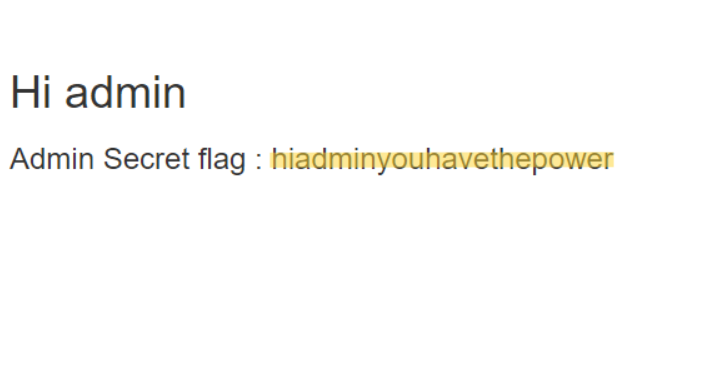

# Challenge Name: Admin has the power

| Category         | Level|
| -----------------| -----|
| Web Security     | easy |

Challenge-Link: https://cybertalents.com/challenges/web/admin-has-the-power

## Challenge Description:

__Administrators__ only has the power to see the flag , can you be one ?

## what I do:

1. There is a __login__ page, so I decided to make a __request__ to see the __response__.

2. In the __request__, I found the `role` parameter with the value `support`, but when I sent the __request__, the __username__ and __password__ were incorrect.

3. I thought about reading the source code to get any information.

4. In the source code, I found a comment containing the __username__ and __password__.

5. I used the `support` __username__ and __password__ and indeed accessed the __support page__.

6. From the support page, I thought of changing the `role` parameter to `admin` and then submitting the request.

7. Indeed, I got the __admin page__ and found the `flag`.

__congratulations!__

---

## __Flag:__ __`hiadminyouhavethepower`__